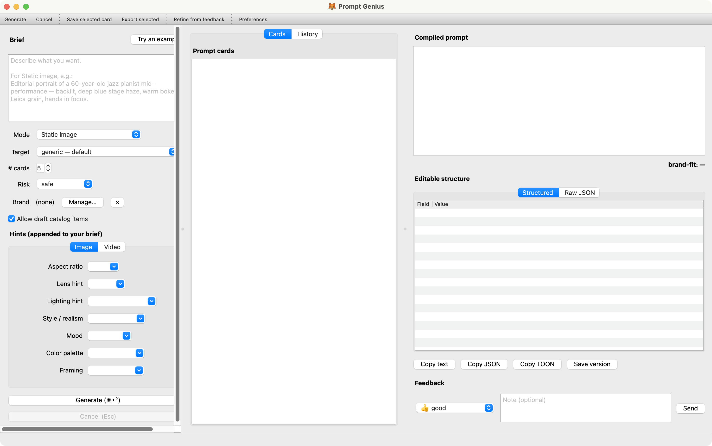
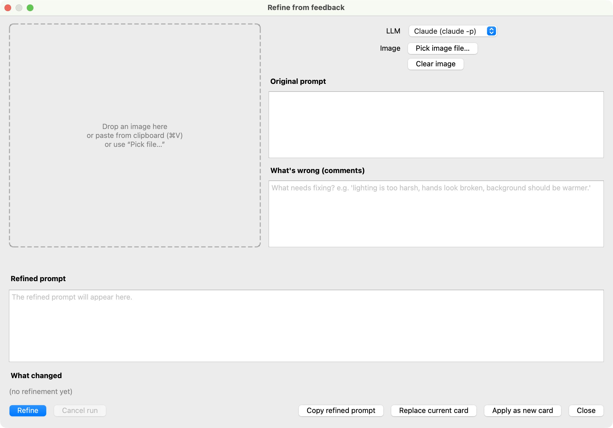
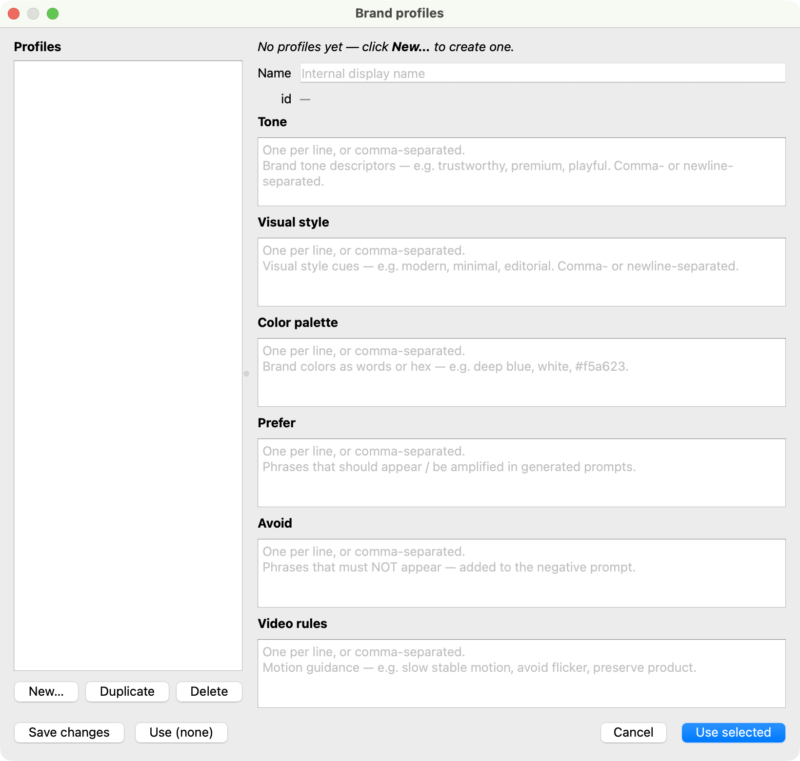

<p align="center">
  
</p>

<h1 align="center">🦊 Prompt Genius</h1>

<p align="center">
  Internal prompt workbench for image and video AI models.
</p>

<p align="center">
  
</p>

---

## What it does

You write a short brief. Prompt Genius gives you back a few good prompt
cards, ready to paste into the image or video model of your choice.

It picks patterns from a curated catalog, mixes in your brand rules,
asks an LLM to draft variants, then compiles each one for the target
model (Nano Banana Pro, Seedance 2.0, Firefly, ChatGPT Image, Runway,
or any model you add).

## Why use it

- **One brief, many cards.** The proposer runs N calls in parallel with
  different creative tilts. You get variety without writing the same
  brief five times.
- **Model-aware compile.** Each target model has an adapter that knows
  the model's parameter syntax and negative-prompt format. You stop
  copy-pasting boilerplate.
- **Brand-aware.** Pick a brand profile and the engine boosts your
  preferred words, blocks the ones you avoid, and scores how close each
  card lands.
- **Self-contained.** The macOS `.app` ships every model and cache it
  needs. No network, no API key, no setup on first launch.

## Quick start (macOS)

Grab the latest DMG, drag the app to Applications, and open it.

```bash
open dist/PromptGenius.dmg     # or wherever you saved it
```

On first launch, right-click the app and choose Open (the build is
ad-hoc signed). The window opens, the splash shows progress while the
retrieval index warms, then you are in.

Type a brief in the left panel. Pick mode and target. Hit Generate
(⌘↩). Cards stream into the middle as the LLM finishes each one.

## Quick start (source)

```bash
pip install -e ".[all]"
prompt-genius-gui                 # the Qt window
prompt-genius generate --brief "..." --mode static_image --n 5   # CLI
```

Python 3.11 or newer. Optional but recommended: install the `claude` or
`codex` CLI on `PATH` so the proposer can call a real LLM. Without
either, it falls back to a deterministic heuristic.

## What is inside

| Path | What it is |
|---|---|
| `prompt_genius/core/` | Pure-function core. Catalog, retrieval, proposer, compiler, adapters. |
| `prompt_genius/gui/` | PySide6 GUI. Three-panel layout, streaming cards, brand manager. |
| `prompt_genius/cli/` | Typer CLI. Same engine, headless. |
| `catalog/` | Curated prompt patterns. JSON per type (lens, lighting, style, ...). |
| `raw_corpus/` | Reference CSVs from [YouMind OpenLab](https://github.com/YouMind-OpenLab). See [raw_corpus/SOURCE.md](raw_corpus/SOURCE.md). |
| `examples/adapters/` | Target-model adapters. One JSON per model. |
| `templates/` | Starter templates for brand profile, briefs, cards. |
| `schemas/` | JSON schemas for everything serializable. |
| `docs/help/` | In-app help, organized as [Diátaxis](https://diataxis.fr/). |
| `docs/` | PRD, roadmap, architecture, taxonomy, risks. |
| `packaging/` | macOS `.app` and `.dmg` build scripts. |

## Adding a target model

Drop a JSON file in `examples/adapters/<your_model>_adapter.json`. The
[adapter schema](docs/help/reference/adapter-schema.md) lists the
fields. Or just run **File > Ingest CSV prompts** with a CSV of example
prompts for that model: the app writes a stub adapter for you.

## Adding a brand

In the app: left panel, click **Manage**. New, fill the tone / avoid /
prefer fields, Save. Profiles live in
`~/Library/Application Support/PromptGenius/brands/` and survive app
updates.

## Building the app

```bash
bash packaging/build_mac_app.sh    # ~3 min: makes dist/PromptGenius.app
bash packaging/build_dmg.sh        # ~30 s: wraps it in dist/PromptGenius.dmg
```

The `.app` is fully self-contained (~950 MB): bundled torch (CPU),
sentence-transformers model, pre-built indexes, catalog, adapters,
templates, raw corpus, Apple Help Book.

## Docs

| Where | What |
|---|---|
| `docs/PRD.md` | Product vision and scope. |
| `docs/ROADMAP.md` | Phase-by-phase plan. |
| `docs/ARCHITECTURE.md` | Internal architecture. |
| `docs/CATALOG_TAXONOMY.md` | Catalog data model. |
| `docs/PROMPT_WORKFLOWS.md` | Image and video workflows. |
| `docs/help/` | Full Diátaxis user docs (shipped as Apple Help Book). |
| `README_DEV.md` | Setup, CLI reference, contributor notes. |

In the app: **Help > 🦊 Prompt Genius Help** (⌘?) opens the help in
macOS Help Viewer with full-text search.

## Credits

The reference corpus under `raw_corpus/` comes from
[youmind.com](https://youmind.com) via the
[YouMind OpenLab](https://github.com/YouMind-OpenLab) GitHub org, a
community-curated, open-source prompt library. Specifically:

- [awesome-nano-banana-pro-prompts](https://github.com/YouMind-OpenLab/awesome-nano-banana-pro-prompts)
  for Nano Banana Pro (Gemini image).
- [seedance-2-prompts-search-skill](https://github.com/YouMind-OpenLab/seedance-2-prompts-search-skill)
  for Seedance 2.0 video.
- YouMind OpenLab community library for Grok Imagine.

Per-row attribution (author, source link) is preserved in every CSV.
Prompt Genius uses these as a reference corpus for retrieval and vocab
mining; the curated catalog under `catalog/` is derived from them, not a
copy. Thanks to the YouMind authors for making this public.

## Repair flows

When a card needs work, two dialogs handle it.

**Refine from feedback** (⌘R). Drop the rendered image, describe what
went wrong, get a revised prompt back. Replace the current card or
apply as a new one.

<p align="center">
  
</p>

**Brand profiles**. CRUD over your brand rules. Tone, visual style,
prefer, avoid, video rules. Profiles live in
`~/Library/Application Support/PromptGenius/brands/` and survive app
updates.

<p align="center">
  
</p>
